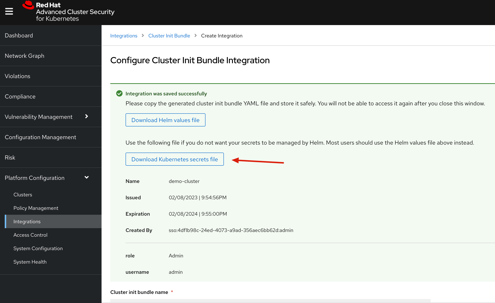

[TOC]


# Architecture


- [**Central**](https://docs.openshift.com/acs/architecture/acs-architecture.html#centralized-components_acs-architecture): [Centralized components] Central is the main component of Red Hat Advanced Cluster Security for Kubernetes and it is installed as a Kubernetes deployment. It handles data persistence, API interactions, and user interface (Portal) access. You can use the same Central instance to secure multiple OpenShift Container Platform or Kubernetes clusters.
- [**Scanner**](https://docs.openshift.com/acs/architecture/acs-architecture.html#centralized-components_acs-architecture): [Centralized component] Red Hat Advanced Cluster Security for Kubernetes includes an image vulnerability scanning component called Scanner. It analyzes all image layers to check for known vulnerabilities from the Common Vulnerabilities and Exposures (CVEs) list. Scanner also identifies vulnerabilities in packages installed by package managers and in dependencies for multiple programming languages.
- [**Sensor**](https://docs.openshift.com/acs/architecture/acs-architecture.html#per-cluster-components_acs-architecture): [1 x Per Cluster] Red Hat Advanced Cluster Security for Kubernetes uses the Sensor component to monitor Kubernetes and OpenShift Container Platform clusters. It handles interactions with the OpenShift Container Platform or Kubernetes API server for policy detection and enforcement, and it coordinates with Collector.
- [**Admission controller**](https://docs.openshift.com/acs/architecture/acs-architecture.html#per-cluster-components_acs-architecture): [1 x Cluster] The admission controller prevents users from creating workloads that violate security policies in Red Hat Advanced Cluster Security for Kubernetes. [1 x Admission Controller]
- [**Collector**](https://redhat-scholars.github.io/acs-workshop/acs-workshop/03-overview-acs.html#acs_architecture): [1 x Node OCP/K8s Nodes] Collector collects and monitors information about container runtime and network activity. It then sends the collected information to Sensor.


# 安装

## 安装ACS operator


## 安装instance


```
apiVersion: platform.stackrox.io/v1alpha1
kind: Central
metadata:
  name: stackrox-central-services
  namespace: stackrox
spec:
  central:
    exposure:
      loadBalancer:
        enabled: false
        port: 443
      nodePort:
        enabled: false
      route:
        enabled: true
    db:
      isEnabled: Default
      persistence:
        persistentVolumeClaim:
          claimName: central-db
    persistence:
      persistentVolumeClaim:
        claimName: stackrox-db
  egress:
    connectivityPolicy: Online
  scanner:
    analyzer:
      scaling:
        autoScaling: Enabled
        maxReplicas: 5
        minReplicas: 2
        replicas: 3
    scannerComponent: Enabled

```


## 获取登陆信息


```
# console 地址
oc get routes/central -n stackrox -o jsonpath='{.spec.host}'

# 登陆密码
oc -n stackrox get secret central-htpasswd -o go-template='{{index .data "password" | base64decode}}'

```


# RHACS Secured Cluster Configuration





```

[root@bastion-test1 acs]# oc apply -f demo-cluster-cluster-init-secrets.yaml -n stackrox
secret/admission-control-tls created
secret/collector-tls created
secret/sensor-tls created
```


# Reference

https://redhat-scholars.github.io/acs-workshop/acs-workshop/index.html


