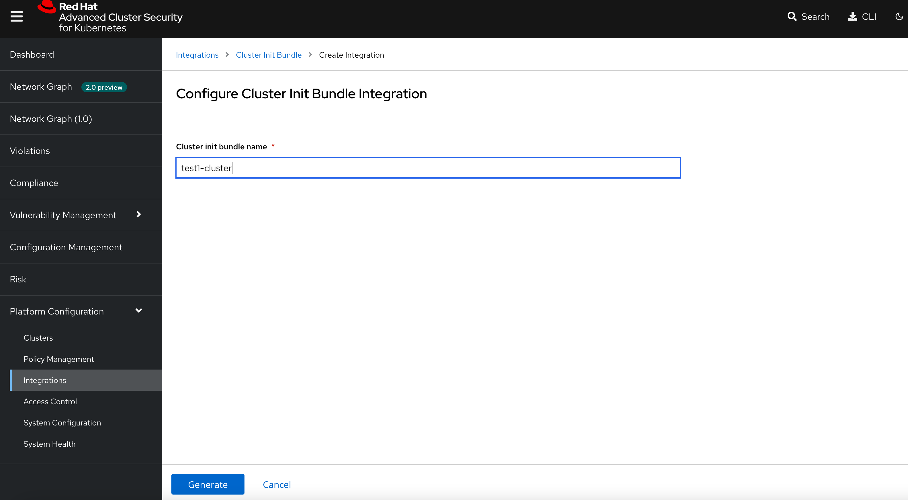

[TOC]


# Architecture


## Central Services

在一个ocp集群上安装 central service, 这个服务包含两个组件，分别是

### central

Central 是 Red Hat Advanced Cluster Security for Kubernetes 的主要组件。 它处理数据持久性、API 交互和用户界面 (Portal) 访问。 可以使用同一个 Central 实例来保护多个 OpenShift Container Platform 或 Kubernetes 集群

### scanner

漏洞扫描组件，它分析所有的image layer来检查漏洞和CVE，scanner 还可以发现已安装软件的漏洞以及多种编程语言的依赖项


## Secured Cluster service


### sensor

1 x Per Cluster

Red Hat Advanced Cluster Security for Kubernetes 使用 Sensor 组件来监控 Kubernetes 和 OpenShift Container Platform 集群。 它处理与 OpenShift 容器平台或 Kubernetes API 服务器的交互以进行策略检测和执行，并与 Collector 协调


### Admission controller

1 x Cluster

准入控制器：准入控制器可防止用户创建违反 Red Hat Advanced Cluster Security for Kubernetes 安全策略的工作负载


### collector

1 x Node OCP/K8s Nodes

Collector 收集和监控有关容器运行时和网络活动的信息。然后它将收集到的信息发送给 Sensor


# 安装

## 安装ACS operator


## 安装 central


新建 stackrox namespace，将ACS 安装到 stackrox下

```
oc new-project stackrox
```


创建 central instance


选择 `All namespaces`


选择 YAML view，将下面yaml 文件贴上


```
apiVersion: platform.stackrox.io/v1alpha1
kind: Central
metadata:
  name: stackrox-central-services
  namespace: stackrox
spec:
  central:
    exposure:
      loadBalancer:
        enabled: false
        port: 443
      nodePort:
        enabled: false
      route:
        enabled: true
    db:
      isEnabled: Default
      persistence:
        persistentVolumeClaim:
          claimName: central-db
    persistence:
      persistentVolumeClaim:
        claimName: stackrox-db
  egress:
    connectivityPolicy: Online
  scanner:
    analyzer:
      scaling:
        autoScaling: Enabled
        maxReplicas: 5
        minReplicas: 2
        replicas: 3
    scannerComponent: Enabled

```


## 获取登陆信息


```
# console 地址
oc get routes/central -n stackrox -o jsonpath='{.spec.host}'

# 登陆密码
oc -n stackrox get secret central-htpasswd -o go-template='{{index .data "password" | base64decode}}'


oc -n stackrox get secret central-htpasswd -o go-template='{{index .data "htpasswd" | base64decode}}'
```


# RHACS Secured Cluster 配置


## 安装 Secured cluster 需求

* 如果基于OCP安装，那么版本需要高于4.6
* 需要已经安装了ACS
* 需要产生一个init bundle 并且应用在cluster上


## 创建 cluster init secret bundle





```

[root@bastion-test1 acs]# oc apply -f test1-cluster-cluster-init-secrets.yaml -n stackrox
secret/admission-control-tls created
secret/collector-tls created
secret/sensor-tls created
```


## 创建SecuredCluster 

创建 stackrox-secured-cluster-services.yaml 文件，内容如下

```
vim stackrox-secured-cluster-services.yaml


apiVersion: platform.stackrox.io/v1alpha1
kind: SecuredCluster
metadata:
  name: stackrox-secured-cluster-services
  namespace: stackrox
spec:
  admissionControl:
    listenOnCreates: true
    listenOnEvents: true
    listenOnUpdates: true
  clusterName: test1-cluster
  perNode:
    collector:
      collection: EBPF
      imageFlavor: Regular
    taintToleration: TolerateTaints
```


## 部署 ACS Demo

### 安装ansible 和 pip3

```
yum install -y ansible 

yum install -y python3-pip.noarch
```


### 部署Demo

```

ansible-galaxy collection install kubernetes.core
pip3 install kubernetes jmespath
git clone https://github.com/rh-mobb/rhacs-demo
cd rhacs-demo

ansible-playbook rhacs-demo.yaml -e stackrox_central_admin_password=[your_pass]

```


## 部署应用


```

oc new-project suspicious
oc run shell --labels=app=shellshock,team=test-team --image=vulnerables/cve-2014-6271 -n suspicious
oc run samba --labels=app=rce --image=vulnerables/cve-2017-7494 -n suspicious
oc run phpunit --labels=app=phpunit --image=vulhub/phpunit:5.6.2 -n suspicious
oc run couchdb --labels=app=couchdb --image=vulhub/couchdb:1.6.0 -n suspicious
```


## 应用DEMO

部署包含漏洞的应用，测试扫描

```
oc new-project test

oc run shell --labels=app=shellshock,team=test-team \
  --image=vulnerables/cve-2014-6271 -n test

oc run samba --labels=app=rce \
  --image=vulnerables/cve-2017-7494 -n test
```


## 管理Secured Cluster

ACS 可以管理多个 Secured Cluster， 方式如下

在 Central 节点上执行以下操作  Platform Configuration -> Cluster -> New Cluster 


修改 Central API Endpoit 地址 


下载安装文件，在 新集群中执行以下命令，将其加入

```

unzip -d sensor sensor-infra-cluster.zip

./sensor/sensor.sh
```


等待部署完毕，查看结果


# Network Graph


网络图是一个流程图、防火墙图和防火墙规则构建器的合体


## 网络流量视图


能显示一个小时内的网络流量图


## 网络策略模拟器

点击 Network Policy Simulator，然后点击 Generate  and simulate network polices， 会按照当前的网络流量产生对应的network policy 


# Vulnerability management

## Dashboard


概述提供了几个重要的报告——漏洞在哪里，最普遍或最近的漏洞，我的  image 来自哪里，以及 OpenShift 本身的重要漏洞


## 扫描image中的漏洞

* Active images: 已经部署的镜像
* Inactive images：没有部署的镜像

默认情况下，只扫描 active images  漏洞，如果想要扫描 inactive images  漏洞，那么需要将镜像标记为`Watched` , watched 的镜像可以是远端镜像仓库中的镜像


## 漏洞过滤

使用搜索框可以过滤漏洞扫描的结果， 支持正则表达式搜索

例如 `Deployment r/.+` 支持所有已经部署的镜像，也就是Active image


## Image CVE 漏洞分析


# Violation

使用 Red Hat Advanced Cluster Security for Kubernetes，可以查看策略违规，深入了解违规的实际原因，并采取纠正措施。

Red Hat Advanced Cluster Security for Kubernetes 内置策略可识别各种安全发现，包括漏洞 (CVE)、违反 DevOps 最佳实践、高风险构建和部署实践以及可疑的运行时行为。无论您使用默认的现成安全策略还是使用自己的自定义策略，Red Hat Advanced Cluster Security for Kubernetes 都会在启用的策略失败时报告违规。


## 违规仪表盘

显示所有的违规事件，可以按照时间，等级 等进行排序


# Risks 


## 风险管理仪表盘

此列表视图显示所有集群和命名空间中的所有部署，按风险优先级排序。

风险也受运行时活动的影响——具有可能表明正在进行的违规活动的部署在左侧有一个红点。显然——列表中的第一个应该是我们的首要关注点。

关于安全，我们需要明白，不可能解决所有的风险源，ACS可以帮助我们确定风险的优先级


##   process discovery


RHACS 可以持续监控部署中 pod 内的运行时活动，构建观察到的行为的基线，并跟踪与该基线的偏差

单击下面 VIEW GRAPH


通过下图可以看到pod中的进程做的事情


# compliance

## CIS 

### CIS docker


### CIS Kubernetes

Center for Internet Security（CIS，互联网安全中心）公布了最佳做法安全建议的基准。CIS Kubernetes 基准是一系列用于配置 Kubernetes 以支持可靠的安全状况的建议。基准与特定的 Kubernetes 版本相关联。CIS Kubernetes 基准是针对开源 Kubernetes 发行版编写的，旨在尽可能广泛应用于各个发行版


## NIST

NIST 网络安全框架提供全面的指导和最佳实践，帮助私营部门组织改善信息安全和网络安全风险管理

美国国家标准技术研究院 (NIST) 是一个非监管机构，旨在通过推进测量科学、标准和技术来促进创新。 NIST 网络安全框架 (NIST CSF) 由标准、指南和最佳实践组成，可帮助组织改善网络安全风险管理。 

NIST CSF 的设计灵活，可与任何行业内任何组织的现有安全流程集成。 它提供了一个极好的起点，可以自此开始在美国几乎任何私营组织中实施信息安全和网络安全风险 管理。


## PCI

支付卡行业（PCI）数据安全标准


##  ACS 集成 OCP compliance 


###  安装 operator 


查看安装后情况

```
[lab-user@bastion ~]$ oc get pod -n openshift-compliance
NAME                                              READY   STATUS    RESTARTS        AGE
compliance-operator-798848b4b9-x5lc6              1/1     Running   1 (4m16s ago)   4m40s
ocp4-openshift-compliance-pp-895db9457-5vb62      1/1     Running   0               4m2s
rhcos4-openshift-compliance-pp-6885cb6877-zgr4b   1/1     Running   0               4m2s
```


此时 compliance 信息如下


### 执行扫描

```
oc apply -f co-scan.yaml

---------
apiVersion: compliance.openshift.io/v1alpha1
kind: ScanSettingBinding
metadata:
  name: cis-scan
  namespace: openshift-compliance
profiles:
- apiGroup: compliance.openshift.io/v1alpha1
  kind: Profile
  name: ocp4-cis
settingsRef:
  apiGroup: compliance.openshift.io/v1alpha1
  kind: ScanSetting
  name: default
```


### 查看结果

```
[lab-user@bastion demo]$ oc get compliancescan -n openshift-compliance
NAME       PHASE     RESULT
ocp4-cis   RUNNING   NOT-AVAILABLE

# 等待扫描完成后再次查看

[lab-user@bastion demo]$ oc get compliancescan -n openshift-compliance
NAME       PHASE   RESULT
ocp4-cis   DONE    NON-COMPLIANT
```


删除 sensor pod 

由于之前已经安装ACS，并且执行过 扫描 动作，所以需要删除 sensor pod 

```
oc delete pods -l app.kubernetes.io/component=sensor -n stackrox
```

重新执行扫描


查看结果

从结果上来看，多了 ocp4-cis 的结果


# Configuration Management

这个页面主要有4个部件


- 按严重程度划分的安全策略违规 （Policy Violations by Severity）
- CIS（信息安全中心）Docker 和 Kubernetes 基准控制的状态 
- 拥有最多集群管理员权限的用户 （USERS WITH MOST CLUSTER ADMIN ROLES）
- 使用最多的secret（SECRETS MOST USED ACROSS DEPLOYMENTS


# DevSecOps


执行 pipeline， 中间在 image-check 过程中出现失败，原因是不满足规则


找到对应的规则，将其 disable 掉


将 这一条 规则 disable 后，重新构建，此时构建成功


# other

## CVSS

CVSS : Common Vulnerability Scoring System，即“通用漏洞评分系统”，是一个“行业公开标准，其被设计用来评测漏洞的严重程度，并帮助确定所需反应的紧急度和重要度”。CVSS的目的是帮助人们建立衡量漏洞严重程度的标准，使得人们可以比较漏洞的严重程度，从而确定处理它们的优先级。CVSS得分基于一系列维度上的测量结果，这些测量维度被称为量度（Metrics）。漏洞的最终得分最大为10，最小为0。得分7~10的漏洞通常被认为比较严重，得分在4~6.9之间的是中级漏洞，0~3.9的则是低级漏洞。所以通常来说，在安全测试中，CWE也好，CVE也好，7~10分的漏洞都是必须要修复的。


## CVE

CVE 的英文全称是“Common Vulnerabilities & Exposures”通用漏洞披露。CVE就好像是一个字典表，为广泛认同的信息安全漏洞或者已经暴露出来的弱点给出一个公共的名称。


CVE+年份+4位随机数字(也有5位数字的情况)


# Reference

https://redhat-scholars.github.io/acs-workshop/acs-workshop/index.html


