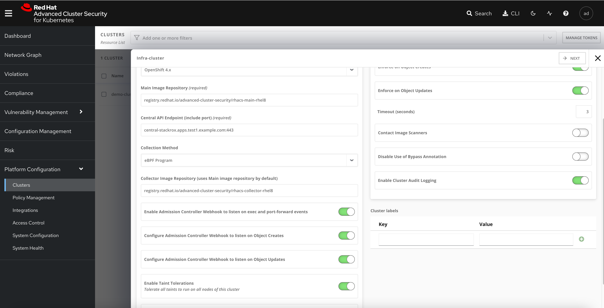

[TOC]


# Architecture


## Central Services

在一个ocp集群上安装 central service, 这个服务包含两个组件，分别是

### central

Central 是 Red Hat Advanced Cluster Security for Kubernetes 的主要组件。 它处理数据持久性、API 交互和用户界面 (Portal) 访问。 可以使用同一个 Central 实例来保护多个 OpenShift Container Platform 或 Kubernetes 集群

### scanner

漏洞扫描组件，它分析所有的image layer来检查漏洞和CVE，scanner 还可以发现已安装软件的漏洞以及多种编程语言的依赖项


## Secured Cluster service


### sensor

1 x Per Cluster

Red Hat Advanced Cluster Security for Kubernetes 使用 Sensor 组件来监控 Kubernetes 和 OpenShift Container Platform 集群。 它处理与 OpenShift 容器平台或 Kubernetes API 服务器的交互以进行策略检测和执行，并与 Collector 协调


### Admission controller

1 x Cluster

准入控制器：准入控制器可防止用户创建违反 Red Hat Advanced Cluster Security for Kubernetes 安全策略的工作负载


### collector

1 x Node OCP/K8s Nodes

Collector 收集和监控有关容器运行时和网络活动的信息。然后它将收集到的信息发送给 Sensor


# 安装

## 安装ACS operator


## 安装instance


```
apiVersion: platform.stackrox.io/v1alpha1
kind: Central
metadata:
  name: stackrox-central-services
  namespace: stackrox
spec:
  central:
    exposure:
      loadBalancer:
        enabled: false
        port: 443
      nodePort:
        enabled: false
      route:
        enabled: true
    db:
      isEnabled: Default
      persistence:
        persistentVolumeClaim:
          claimName: central-db
    persistence:
      persistentVolumeClaim:
        claimName: stackrox-db
  egress:
    connectivityPolicy: Online
  scanner:
    analyzer:
      scaling:
        autoScaling: Enabled
        maxReplicas: 5
        minReplicas: 2
        replicas: 3
    scannerComponent: Enabled

```


## 获取登陆信息


```
# console 地址
oc get routes/central -n stackrox -o jsonpath='{.spec.host}'

# 登陆密码
oc -n stackrox get secret central-htpasswd -o go-template='{{index .data "password" | base64decode}}'

```


# RHACS Secured Cluster 配置


## 安装 Secured cluster 需求

* 如果基于OCP安装，那么版本需要高于4.6
* 需要已经安装了ACS
* 需要产生一个init bundle 并且应用在cluster上


## 创建 cluster init secret bundle


```

[root@bastion-test1 acs]# oc apply -f demo-cluster-cluster-init-secrets.yaml -n stackrox
secret/admission-control-tls created
secret/collector-tls created
secret/sensor-tls created
```


## 创建SecuredCluster 


```
apiVersion: platform.stackrox.io/v1alpha1
kind: SecuredCluster
metadata:
  name: stackrox-secured-cluster-services
  namespace: stackrox
spec:
  admissionControl:
    listenOnCreates: true
    listenOnEvents: true
    listenOnUpdates: true
  clusterName: demo-cluster
  perNode:
    collector:
      collection: EBPF
      imageFlavor: Regular
    taintToleration: TolerateTaints
```


## 部署 ACS Demo

### 安装ansible 和 pip3

```
yum install -y ansible 

yum install -y python3-pip.noarch
```


### 部署Demo

```

ansible-galaxy collection install kubernetes.core
pip3 install kubernetes jmespath
git clone https://github.com/rh-mobb/rhacs-demo
cd rhacs-demo

ansible-playbook rhacs-demo.yaml -e stackrox_central_admin_password=[your_pass]

```


## 部署应用


```

oc new-project suspicious
oc run shell --labels=app=shellshock,team=test-team --image=vulnerables/cve-2014-6271 -n suspicious
oc run samba --labels=app=rce --image=vulnerables/cve-2017-7494 -n suspicious
oc run phpunit --labels=app=phpunit --image=vulhub/phpunit:5.6.2 -n suspicious
oc run couchdb --labels=app=couchdb --image=vulhub/couchdb:1.6.0 -n suspicious
```


## 管理Secured Cluster

ACS 可以管理多个 Secured Cluster， 方式如下

在 Central 节点上执行以下操作  Platform Configuration -> Cluster -> New Cluster 


修改 Central API Endpoit 地址 




下载安装文件，在 新集群中执行以下命令，将其加入

```

unzip -d sensor sensor-infra-cluster.zip

./sensor/sensor.sh
```


等待部署完毕，查看结果


# Vulnerability management

## Dashboard


概述提供了几个重要的报告——漏洞在哪里，最普遍或最近的漏洞，我的  image 来自哪里，以及 OpenShift 本身的重要漏洞


## 扫描image中的漏洞

* Active images: 已经部署的镜像
* Inactive images：没有部署的镜像

默认情况下，只扫描 active images  漏洞，如果想要扫描 inactive images  漏洞，那么需要将镜像标记为`Watched` , watched 的镜像可以是远端镜像仓库中的镜像


## 漏洞过滤

使用搜索框可以过滤漏洞扫描的结果， 支持正则表达式搜索

例如 `Deployment r/.+` 支持所有已经部署的镜像，也就是Active image


## Image CVE 漏洞分析


# Risks 


# compliance


## Integrating the OpenShift Compliance Operator with ACS


```


```


Before integrate with compliance operator


after run 


# other

## CVSS

CVSS : Common Vulnerability Scoring System，即“通用漏洞评分系统”，是一个“行业公开标准，其被设计用来评测漏洞的严重程度，并帮助确定所需反应的紧急度和重要度”。CVSS的目的是帮助人们建立衡量漏洞严重程度的标准，使得人们可以比较漏洞的严重程度，从而确定处理它们的优先级。CVSS得分基于一系列维度上的测量结果，这些测量维度被称为量度（Metrics）。漏洞的最终得分最大为10，最小为0。得分7~10的漏洞通常被认为比较严重，得分在4~6.9之间的是中级漏洞，0~3.9的则是低级漏洞。所以通常来说，在安全测试中，CWE也好，CVE也好，7~10分的漏洞都是必须要修复的。


## CVE

CVE 的英文全称是“Common Vulnerabilities & Exposures”通用漏洞披露。CVE就好像是一个字典表，为广泛认同的信息安全漏洞或者已经暴露出来的弱点给出一个公共的名称。


CVE+年份+4位随机数字(也有5位数字的情况)


# Reference

https://redhat-scholars.github.io/acs-workshop/acs-workshop/index.html


